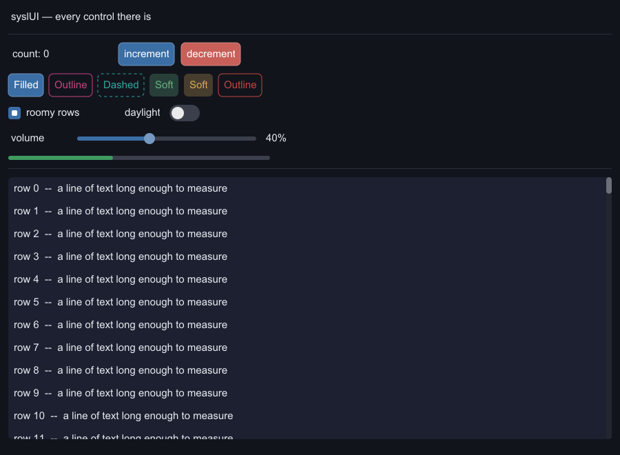
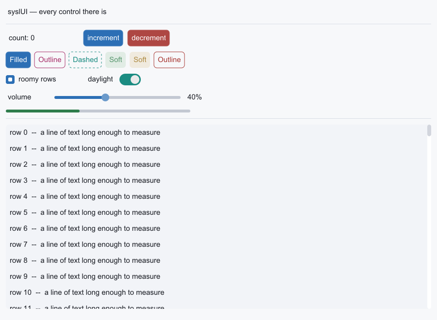
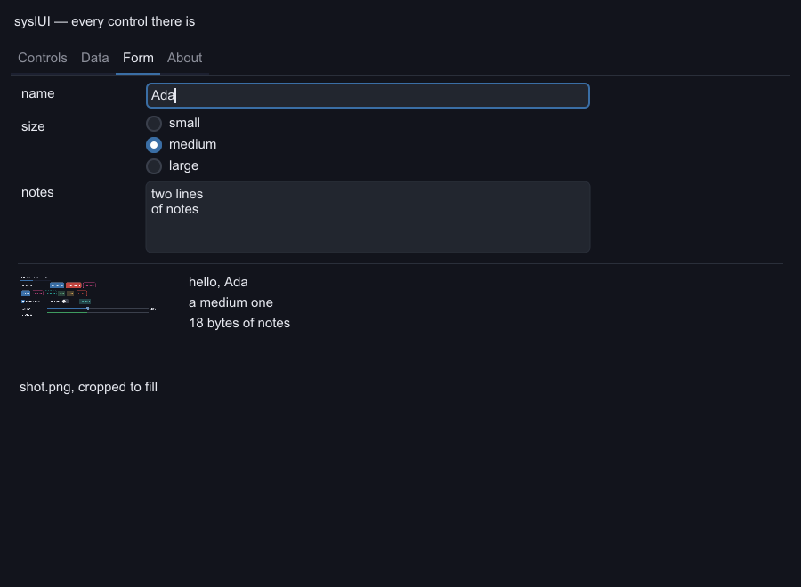

# syslui-demo

The worked example for [`syslui`](https://github.com/sysl-lang/syslui) — every control the toolkit
has, drawn by a software rasterizer and handed to SDL3 as one streaming texture.



The same frame under the other theme — one switch, and every control, label, panel, rule and
scrollbar below it moved. Nothing in the program names a colour: a button says `.Error` and the
theme says what that is.



The form tab, with the keyboard actually in a field — the focus ring and the caret exist only after
a press has landed, so that shot takes two frames and keeps the second.



That picture is not a photograph of a window. It is `./syslui-demo --shot`, which draws one frame
and asks PlutoVG to write its own surface out — so it is byte for byte what the window shows, and
it is produced by the same program with no display server anywhere near it.

```
sysl build .
./syslui-demo              # a window: every control, and a scrollable table
./syslui-demo --shot       # no window — draws one frame and writes shot.png
./syslui-demo --shot light # …under the light theme, as shot-light.png
./syslui-demo --shot form  # …the form tab with a field focused, as shot-form.png
./syslui-demo --bench      # no window — prints what a rebuild, a rasterize and an upload cost
./syslui-demo --bench 3000 # …at whatever list length you ask for
```

The window is what a person can click. The benchmark is what a machine can check. The screenshot is
the only automated thing that says what the interface *looks* like — every test in the package
asserts a recording, and a recording cannot tell you a label has fallen off its button.

## The split this demonstrates

**syslUI draws; it does not present.** What comes out of it is a block of premultiplied ARGB32
pixels in a PlutoVG surface. Getting those onto a screen is the application's job, and here it is
one `TextureAccess.Streaming` texture uploaded once a frame — `PixelFormat.Argb8888` is SDL's name
for exactly the bytes PlutoVG writes, so nothing is converted.

That split is why the same tree, the same widgets and the same backend serve a desktop and a phone:
SDL3 is the presenter on both, and cairo is available on neither.

**There is no SDL_ttf here, and no FreeType and no fontconfig.** PlutoVG rasterizes glyphs through
the `stb_truetype` it vendors, so text is measured and drawn by the same library that draws
everything else — which also means the metrics are identical on every platform, where two font
stacks would have disagreed.

## The frame loop is not in here

**The interactive path is one call**, and the hundred and eleven lines that used to be here are the
reason [`syslui-sdl`](https://github.com/sysl-lang/syslui-sdl) exists — a window, an event pump, a
frame loop and a texture upload are the same on every machine, and this program had a copy of all
four. The Android demo had the other copy.

```
run(app("syslUI", () -> screen(m, rows), () -> window_ground(m), WIDTH, HEIGHT, shortcuts(m)))
```

What is left is what an application actually owns: the tree, the colour behind it, and its own
shortcuts. `shortcuts` is handed every event before the driver sees it and answers `true` when it has
dealt with one — which is where ⌘C, escape and the mouse wheel live, and where a driver that guessed
would have been wrong for the second program that used it.

**The two offscreen modes are not a frame loop**, so they still open their own window and drive a
canvas by hand — they import sdl3 and plutovg directly, and reach both *through* the driver, because
imports are transitive as of sysl 0.0.73. This project's whole `dependencies` block is one line.

## What it measures

Every allocation the program makes goes through a counter — `package.hocon`'s `allocator` block
points sysl's storage at libc's `malloc` with a `++` in front of it, so these are the program's real
allocation traffic rather than a model of it. A frame at 900×660, with the table:

| rows | rebuild | + rasterize | allocations a frame | upload |
|---:|---:|---:|---:|---:|
| 300 | 2.1 µs | 1.21 ms | 933 | 66 µs |
| 3000 | 2.1 µs | 1.33 ms | 933 | 66 µs |

**A table is lazy, so a rebuild costs nothing at all**: `screen()` allocates the table node and
keeps a slice, and the rows become views during paint. That is why the rebuild does not grow with
the list.

**And only the rows in the window are built.** Culling stops an invisible row being *painted*, but
the row still had to exist to be culled — 300 rows meant 12,605 boxes made and thrown away every
frame. A table's rows are all the same height, so which ones are visible is arithmetic; the numbers
above are what that is worth, and the reason they do not move between 300 rows and 3000.

**The upload is not the problem anybody expects it to be.** 2.3 MiB across to the GPU every frame is
0.4% of the budget. Whole-surface uploads are what streaming textures are for.

What is left is the rasterizer, and it is almost all **text**: the same window with no list at all
draws in 0.51 ms. PlutoVG rasterizes each glyph's outline afresh every frame, so the next thing
worth attacking is a glyph cache in that package, not anything in syslUI. The demo holds a
vsync-locked 120 fps.

**So the per-frame arena the mobile survey argued for is refused**, and by a wide margin: allocation
is a rounding error beside the drawing.

## What a person driving it costs, which the batch numbers hide

Forty seconds of clicking and scrolling, 300 rows, logged a second at a time. These predate the
PlutoVG backend and measure a **rebuild**, which is the half that does not depend on how the frame
is drawn.

| what is happening | rebuilds a second | cost each |
|---|---:|---:|
| scrolling — a burst of wheel events | 11–20 | **20–22 µs** |
| one click, then a pause | 1–2 | **26–37 µs** |

**Sustained interaction is the cheap case**, by half again. The likely reason is warmth rather than
anything structural: a burst hands hundreds of boxes back to the allocator and immediately asks for
hundreds more, so the free list and the cache lines are exactly right, where an isolated rebuild
after an idle second finds neither. Note which way that cuts — the case a person actually feels is
the one where allocation is *cheapest*.

## What the program is

```
column(spacing = 12):
    text("syslUI — every control there is").padding(4)

    divider()

    row([
        text(s"count: ${m.count.read()}").padding(6).frame(150, 30),
        button("increment", bump(m.count, 1)),
        button("decrement", bump(m.count, -1), .Error)
    ], 10)

    row([
        button("Filled", nothing),
        button("Outline", nothing, .Secondary, .Outline),
        button("Dashed", nothing, .Accent, .Dashed),
        button("Soft", nothing, .Success, .Soft),
        button("Soft", nothing, .Warning, .Soft),
        button("Outline", nothing, .Error, .Outline)
    ], 8)

    row([
        checkbox(m.roomy, "roomy rows"),
        spacer().frame(40, 1),
        text("daylight").padding(2),
        switch(m.daylight, .Accent)
    ], 12)

    grid():
        text("volume").padding(4).cell(4)
        slider(m.volume, 0, 100, 260).cell(16)
        text(s"${m.volume.read()}%").padding(4).cell(4)

        text("progress").padding(4).cell(4)
        progress(real(m.volume.read()) / 100.0, 380, .Success).cell(16)
        text("").cell(4)

    divider()

    table([col("#", true), flex_col("name"), col("status"), col("value", true)],
          rows, m.offset, 340, Some(i -> m.count.set(int(i))), m.roomy.read())
        .panel()
```

…and then `body.padding(12).foreground(look.ink).restyle(_ -> look)`, which is the whole of the
theme switch.

**No call site names a colour.** A button says `.Error`, a bar says `.Success`, the surface says
`.panel()`, and the theme says what each of those is — which is what makes one `.restyle` at the
root change every one of them. A hex literal here would be a colour that was still there when the
light theme was not.

**Three of the controls change the screen rather than themselves**: "daylight" restyles the whole
tree, "roomy rows" turns the table's striping off, and tapping a table row sets the counter. Each is
a signal write, a rebuild and a visibly different tree — a demo whose switches only moved themselves
would be showing the animation and hiding the architecture.

**The last line is a call chain broken before its dot**, which no released compiler could read when
this was written. A chain of modifiers is how anything gets styled, so a chain that cannot be broken
is a chain that has to fit on one line.

**The volume and progress lines are a `grid`, not two `row`s**, and that is the difference between
the two containers in one place: "volume" and "progress" are different lengths, so a row would have
started each control wherever its own label's text ended. On the grid the label takes four
twenty-fourths and the control sixteen, so both controls begin and end on the same columns.

The whole tree is rebuilt on every signal write — deliberately the whole tree, so the number is the
worst case rather than what rebuilding only what read the signal would buy later. The frame is drawn
every time round regardless, because a hover easing toward its colour is a change to the picture and
not to the state.
